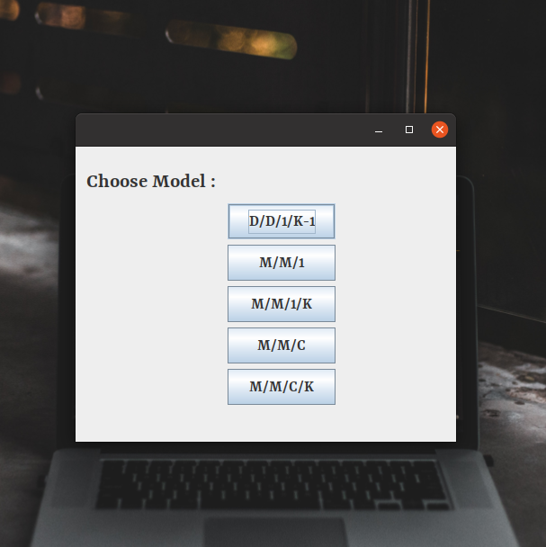
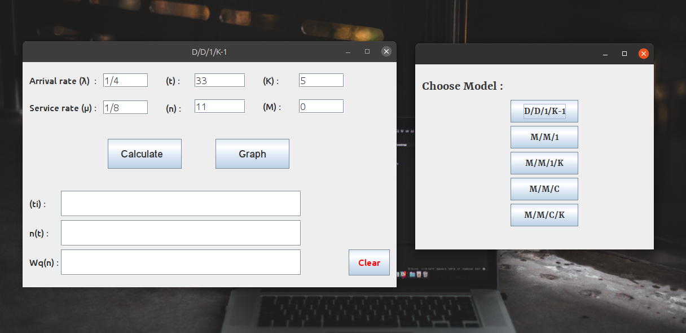
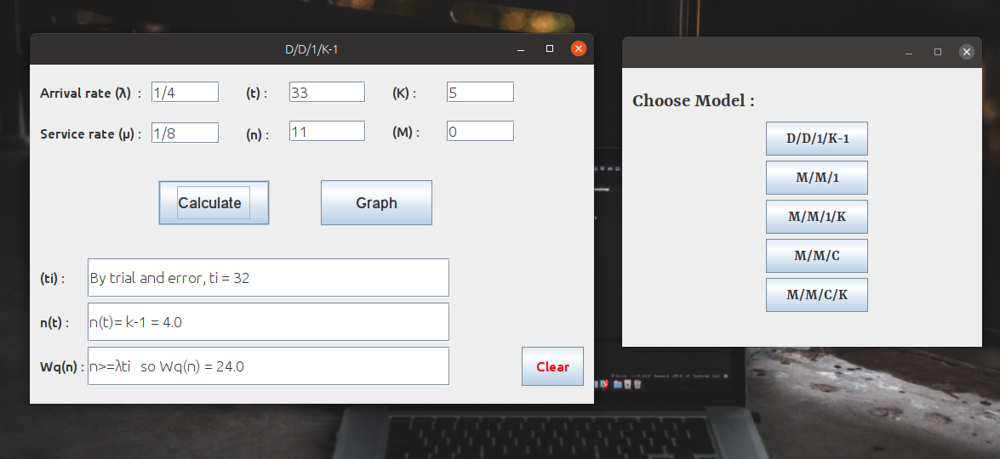
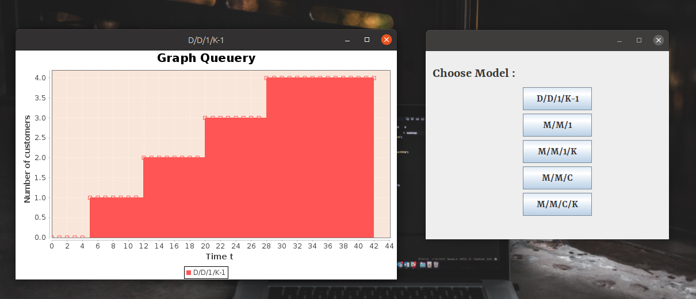
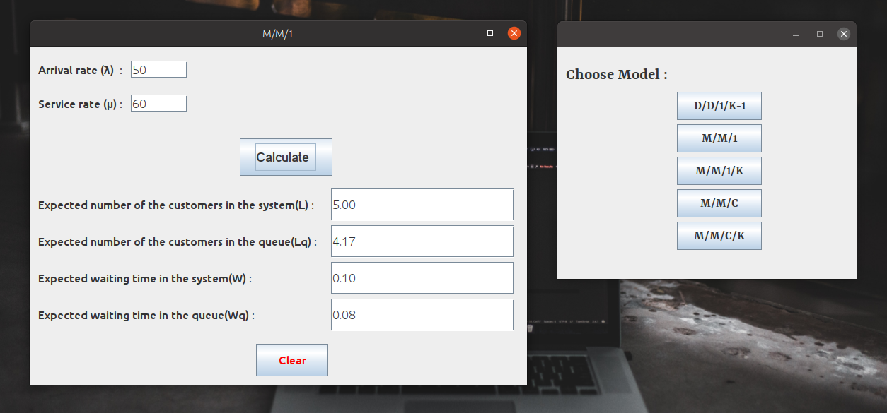

# Queueing-Theory-and-Modeling
Implementing the Deterministic and Stochastic Models Using java.
## About Queueing Theory : 
Sharing of resources and waiting in queues is a common phenomenon that occurs in every facet of our lives.
In a computer system, computer jobs are queued for CPU or I/O devices in various stages of their processing.
The understanding and prediction of the stochastic behavior of these queues will provide a theoretical insight 
into the dynamics of these shared resources and how they can be designed to provide better utilization.

## Overview:
#### The modeling and analysis of waiting queues/networks is the main subject of this simple project.

implementing, using Java and JavaX GUI:
* Model D/D/1/K-1 Only this Model can be sketched.
* Model M/M/1
* Model M/M/1/K
* Model M/M/C
* Model M/M/C/K

 ## How it works :
 Screenshots :
 1. 
 2. 
 3. 
 4. 
 5. 
 
 #### That's All!
